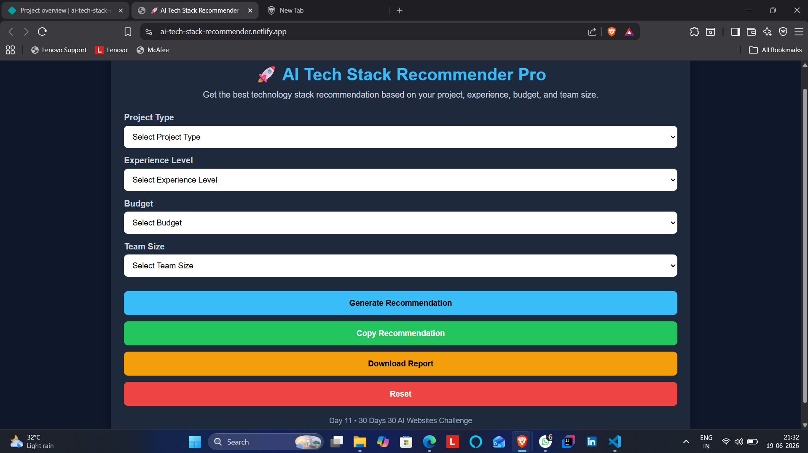
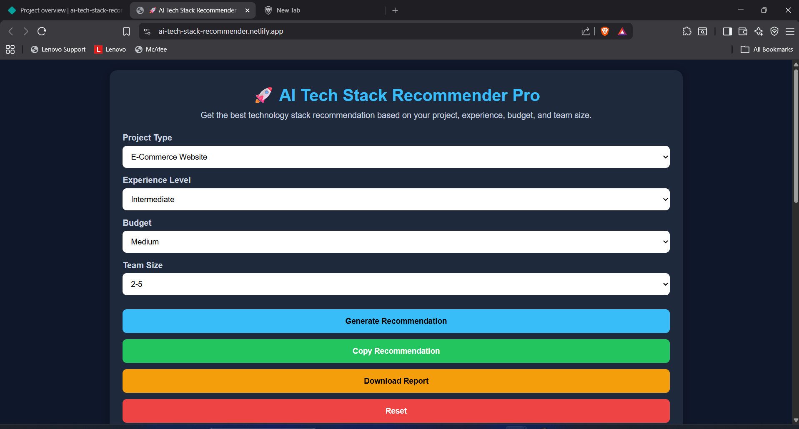
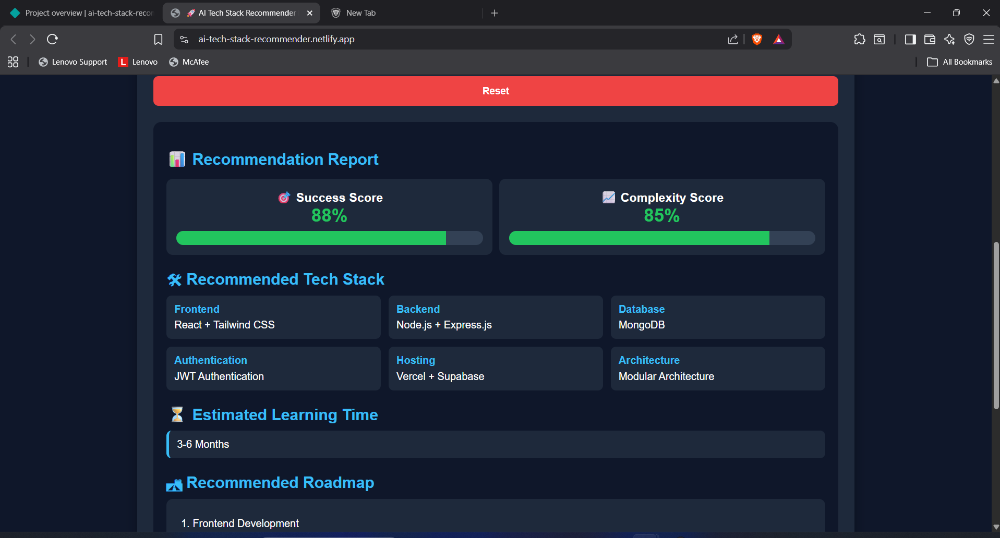
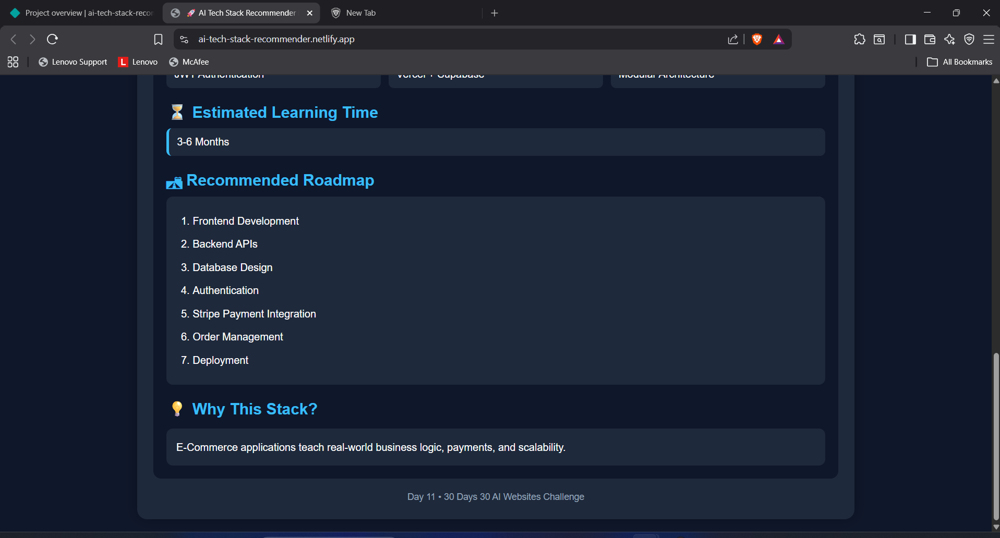

# AI Tech Stack Recommender Pro

🚀 Day 11 of my 30 Days 30 AI Websites Challenge

AI Tech Stack Recommender Pro helps developers choose the best technology stack based on project type, experience level, budget, and team size.

## 🌐 Live Demo

https://ai-tech-stack-recommender.netlify.app/

## 📸 Screenshots

## ✨ Features

* Project Type Selection
* Experience-Based Recommendations
* Budget-Based Recommendations
* Team Size Analysis
* Recommended Tech Stack
* Success Score
* Complexity Score
* Learning Roadmap
* Download Report

## 🛠Technologies Used

* HTML
* CSS
* JavaScript
* AI-Assisted Development

## 📋 How It Works

1. Select Project Type
2. Select Experience Level
3. Select Budget
4. Select Team Size
5. Generate Recommendation

## 🎯 The Application Provides

* Frontend Recommendation
* Backend Recommendation
* Database Recommendation
* Hosting Recommendation
* Architecture Recommendation
* Learning Roadmap
* Success & Complexity Scores

## 🚀 Challenge

This project is part of my 30 Days 30 AI Websites Challenge where I build and publish one AI-assisted website every day.

## 📈 Progress

- Day 1 ✅ AI Resume Analyzer
- Day 2 ✅ AI Career Roadmap Generator
- Day 3 ✅ AI Project Idea Generator
- Day 4 ✅ AI Skill Gap Analyzer
- Day 5 ✅ AI Interview Question Generator
- Day 6 ✅ AI Learning Path Recommender
- Day 7 ✅ AI LinkedIn Post Generator
- Day 8 ✅ AI Salary Predictor
- Day 9 ✅ AI Startup Idea Validator
- Day 10 ✅ AI Study Planner
- Day 11 ✅ AI Tech Stack Recommender Pro

## 👨‍💻 Author

Bettam Anand

B.Tech CSE (Data Science)

JNTUH University College of Engineering Palair
